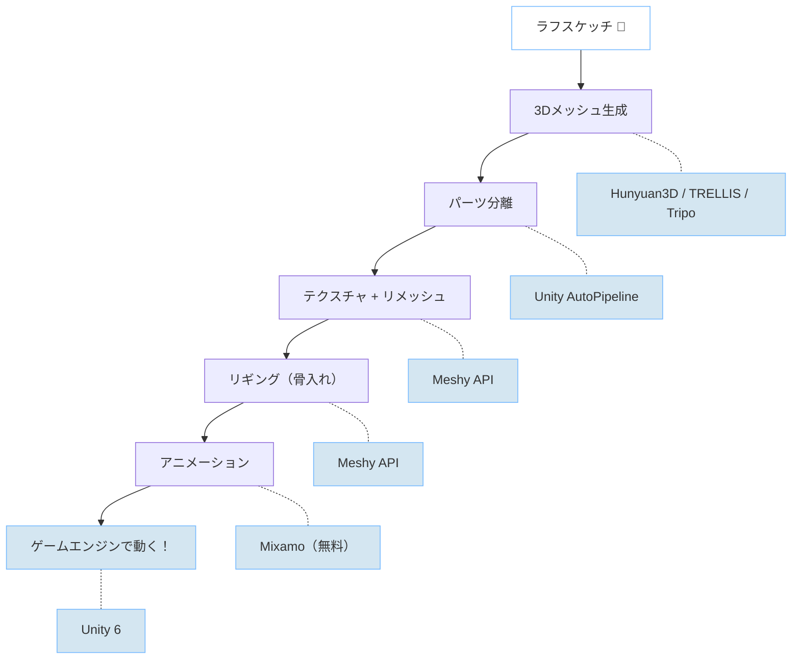
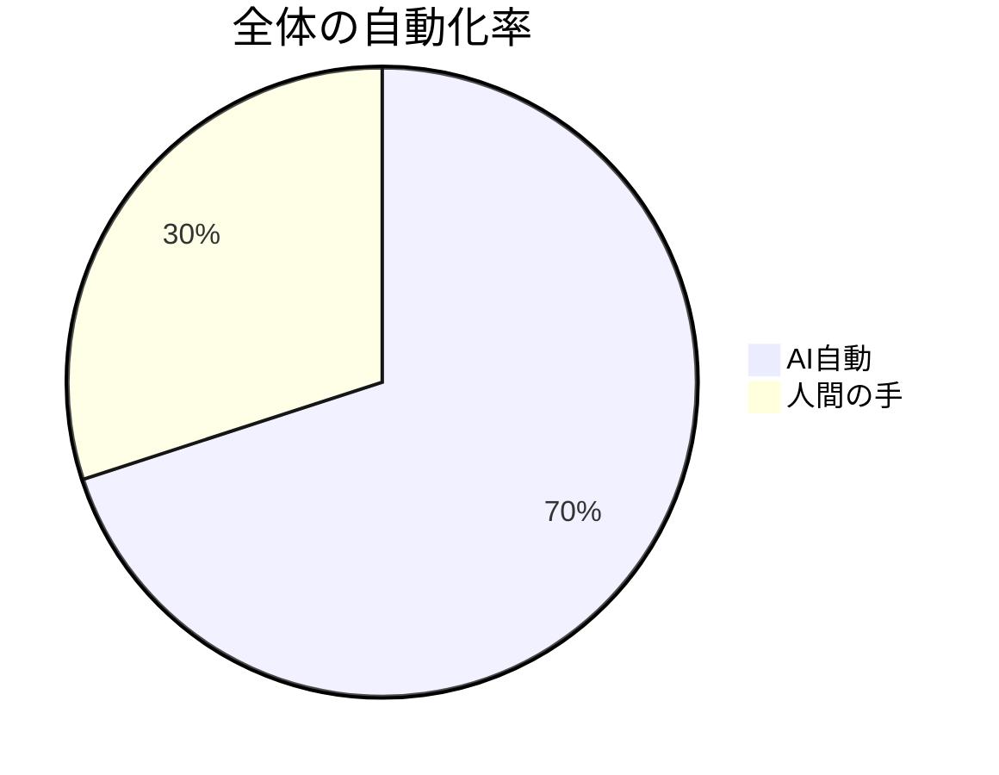
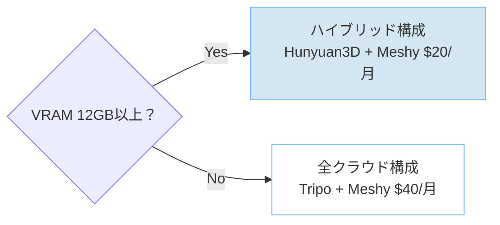

<!-- 概要: ラフスケッチ1枚から、Hunyuan3D・TRELLIS・Tripo・Meshy・Mixamoを使ってゲームで動く3Dキャラクターを作るまでの全工程を解説。RTX 4070 Ti（12GB VRAM）での実測データ付き。 -->

# 【3D AI】スケッチ1枚からゲーム用3Dキャラを作ってみた — 2026年版AIパイプラインの実力

突然ですが、落書きみたいなスケッチからゲームで動く3Dキャラを作れたらいいのに、って思ったことないですか？

自分は、ゲーム開発に手を出してみたいけどずっとそこで止まってたんですよね。で、最近の3D AI系ツールがだいぶ使い物になってきたらしいという噂を聞いて、実際に試してみました。

結論から言うと、**スケッチ1枚 → テクスチャ付き3Dモデル → リギング → アニメーション → ゲームエンジンで動く**、ここまで到達できました。ただし「全部AIにおまかせ」とはいかなかった。

---

## やりたかったこと



全6ステップ。ローカルGPUとクラウドAPIのハイブリッド構成です。

---

## 使った環境

| 項目 | スペック |
|------|---------|
| GPU | RTX 4070 Ti（**12GB VRAM**） |
| CPU | Ryzen 7 9700X |
| RAM | 32GB DDR5 |
| OS | Windows 11 + WSL2 |

12GBのVRAMだと結構ギリギリ。このあと何度もVRAM不足と戦うことになります。

---

## 使ったツールとお金の話

先にお金の話をしておくと、**実際に使ったのは約\$2（Meshy 100クレジット分）** でした。

| ツール | 何に使った | お金 |
|--------|-----------|------|
| Hunyuan3D-2GP | スケッチ→3Dメッシュ | 無料 |
| TRELLIS | 同上 | 無料 |
| Tripo | 同上 | 無料枠で足りた |
| Meshy Pro | テクスチャ・リメッシュ・リギング | **\$20/月**（100cr消費） |
| Mixamo | アニメーション付与 | 無料 |
| Blender | GLB→FBX変換 | 無料 |
| Unity 6 | エンジン検証 | 無料 |

月額で言うと \$20〜23 くらい。メッシュ生成をローカルでやって、後処理だけクラウドに投げるのがコスパ最強でした。

> 注意:
> 今回は自作スケッチのみを使用しています。Tripo / Meshy / Mixamo など外部サービスに素材をアップロードするため、
> 未公開IP・顧客データ・機密アセットは投入しない運用が前提です。
> また、ローカル実行にはコミュニティforkも含まれるため、検証は隔離環境で行うのが安全です。

---

## Step 1: スケッチから3Dメッシュを作る

ここがパイプラインの起点。同じスケッチを3つのツールに食わせて、どれが一番いいか比較しました。

まずはこのスケッチを見てほしい。これが入力。


*こんな落書きレベルのスケッチが起点*

そしてこれが3ツールの出力をUnityに並べたもの。左からHunyuan3D、TRELLIS、Tripo。


*同じスケッチから3つのAIが生成した3Dモデル。結構違う*

もう1キャラ。丸いやつ。


*round_char。ゆるい感じのキャラ*


*round_charの3ツール比較。Hunyuan3D（左）が一番元のスケッチに忠実*

### 各ツールの結果

| ツール | 方式 | 生成時間 | ファイルサイズ | ざっくり評価 |
|--------|------|---------|-------------|------------|
| **Hunyuan3D-2GP** | ローカル | 3〜5分 | 2.1〜2.6MB | シルエットの再現度が一番高い |
| **TRELLIS** | ローカル | 1〜3分 | 867KB〜1.2MB | 軽い。ただし解像度制限あり |
| **Tripo** | クラウドAPI | **15秒** | 6.3〜12MB | 速い＆高密度。ただし有料 |

### Hunyuan3D-2GP（ローカル）

Tencentが出してる3D生成AIのコミュニティ改良版。公式の推奨ではVRAM 24GB必要だけど、このフォーク版はMMGPというメモリ最適化技術で6GBから動く。

自分の環境では `--profile 3` で、VRAM 9GB目安で安定動作。

```bash
conda activate hunyuan3d
python gradio_app.py --profile 3 --turbo
# ブラウザで localhost:7860 を開いてスケッチをアップロード
```


*Hunyuan3Dの生成メッシュビューアー。Appearanceモードで3Dモデルを確認できる*


*Hunyuan3Dの出力。スケッチのシルエットをよく拾ってる*

**良かった点**: シルエットの再現度が3ツール中ベスト。頂点が共有されてるのでパーツ分離もしやすい。

**微妙だった点**: セットアップがちょっと面倒。

### TRELLIS（ローカル）

Microsoftのやつ。速くて軽いけど、12GBだと512x512の解像度が上限。


*TRELLISの出力。12GB環境だと解像度が厳しく、テクスチャにブロックノイズが目立つ*

**良かった点**: 生成が速い。1〜3分。出力ファイルが軽い（867KB〜1.2MB）。

**微妙だった点**: 12GBだと解像度制限（512x512）がかかり、sword_charは黒い板に顔が貼り付いたような仕上がりに。round_charは形自体は取れたが厚みが薄い。24GB以上のGPUなら違う結果になる可能性あり。

### Tripo（クラウド）

15秒で3Dモデルが出てくるのは正直すごい。API経由で自動化もしやすい。


*Tripoの出力。高密度メッシュで細かいところまで出てる*

**良かった点**: 圧倒的に速い。セットアップほぼ不要。

**微妙だった点**: 無料枠でもいけるけど、本格的に使うなら月\$20。メッシュが高密度すぎてそのままだとゲーム向きじゃない。

### 3Dモデルの精度比較 — 実際どこまで「ちゃんとした3D」になってるのか

スケッチから3Dを起こしてくれるのはすごいけど、**本当に立体として破綻なく成立してるの？** という点を正直に書く。

| 評価項目 | Hunyuan3D | TRELLIS | Tripo |
|---------|-----------|---------|-------|
| シルエット再現度 | ◎ スケッチにかなり忠実 | △ round_charは形を拾うがsword_charは破綻 | ○ 形は取れてるが解釈が独自 |
| 立体としての完成度 | ○ 厚みがあり裏側も破綻なし | × 板状で厚みがほぼない | ◎ 完全な立体、裏も綺麗 |
| メッシュの欠損 | ほぼなし | テクスチャにブロックノイズ、体が板状に潰れる | なし |
| 顔の再現 | △ のっぺり | × sword_charは顔が判別困難 | ◎ 目・口・表情まで再現 |
| 剣の再現 | × 生成されず | × 認識できず | ◎ 剣の形状・柄まで分離して再現 |
| メッシュ構造 | 頂点共有あり（後工程に有利） | 三角形ごとに頂点独立 | 三角形ごとに頂点独立 |

#### 具体的に見つかった問題

**Hunyuan3D**: スケッチの輪郭はよく拾う。ただし「絵を膨らませた」ような形状になりがち。

頭・腕・脚のシルエットは忠実だけど、剣のような細いパーツは認識されず省略された。テクスチャもなく白一色のクレイモデル状態。round_charは比較的うまくいったが、目や口はのっぺり。

厚みはちゃんとあって、360度回転させても裏側に穴や欠損はなかった。

**TRELLIS**: 12GB環境だと解像度制限が厳しい。

round_charはレリーフみたいな板状になってしまい、正面以外から見ると厚みがほぼない。sword_charはテクスチャがブロックノイズだらけで、黒い板に顔が貼り付いたような見た目になった。

24GB環境なら結果は変わるかもしれないが、12GBではゲーム用アセットとしては厳しい。

**Tripo**: 3ツール中、**唯一「ちゃんとした3Dキャラ」と呼べるレベル**。

sword_charは目、口、剣の柄まではっきり造形されていた。round_charも正面・側面・背面すべて破綻がない。ただしスケッチの解釈が独自で、元のラフさが「きれいな3Dキャラ」に整えられる傾向はある。

自分の場合は後工程でパーツ分離したかったので、メッシュ構造が扱いやすいHunyuan3Dを常用することにした。完成度重視ならTripo。TRELLISは12GBだとちょっと厳しかった。

### Step 1の感想

自分の結論は **「普段使いはHunyuan3D、急いでるときはTripo」** です。TRELLISは12GBだとちょっと制約がきつい。

---

## Step 2: パーツ分離

ゲーム用アセットって、全身1つのメッシュだと困る場面が多い。武器の着脱とかパーツ破壊とか。なので「頭・体・武器」みたいに分離したい。

### 最初の計画は失敗した

PartCrafterっていうツールを使おうとしたら、HuggingFace Spaceが**停止中**。しかもよく調べたら、このツールは「既存メッシュを分割する」んじゃなくて「画像からパーツごとに3D生成する」ものだった。目的が違った。

### 代わりにUnityで自動分離

Unity 6のEditor拡張として、接続成分分析で自動分離するスクリプトを書いた。Union-Findアルゴリズムを使っている。

```
GLBインポート → 頂点の接続関係を解析 → 独立した塊ごとに分離 → OBJエクスポート
```

**結果**: Hunyuan3Dで生成したメッシュはちゃんと分離できた。一方、TRELLIS / Tripo / Meshyのメッシュは三角形ごとに頂点が独立してるので、全部バラバラになってしまった（数百パーツ...）。

> ここでもHunyuan3Dのメッシュ品質の良さが光った。頂点が共有されてるって地味だけどめちゃ大事。

---

## Step 3: テクスチャ再生成 + リメッシュ

AI生成のメッシュはテクスチャが微妙なことが多い。Meshy APIの Retexture で PBR テクスチャを貼り直して、Remesh でポリゴン数を最適化。

全6モデル（3ツール × 2キャラ）に対して実行しました。

### Retexture　テクスチャ貼り替え

プロンプトは `"cute chibi character, colorful, smooth surface, game-ready"` で統一。

| 元ツール | 処理時間 | 出力サイズ | コスト |
|---------|---------|---------|--------|
| Hunyuan3D | 100〜106秒 | 6.3〜9.6MB | 10cr |
| TRELLIS | 〜80秒 | 3.1〜5.5MB | 10cr |
| Tripo | 90〜110秒 | 11〜19MB | 10cr |

**小計: 60クレジット（\$1.20）**

### Remesh　ポリゴン最適化

10Kポリゴン、quad topologyを目標に最適化。

| 元ツール | 処理時間 | 出力サイズ | コスト |
|---------|---------|---------|--------|
| Hunyuan3D | 29〜30秒 | 4.1〜5.3MB | 5cr |
| TRELLIS | 10〜15秒 | 4.2〜5.8MB | 5cr |
| Tripo | 20〜25秒 | 5.2〜7.8MB | 5cr |

**小計: 30クレジット（\$0.60）**

Retexture後とRemesh後を並べるとこんな感じ。


*Retexture後。PBRテクスチャが乗ってゲームっぽくなった*


*Remesh後。ポリゴンが整理されてエンジンフレンドリーに*

round_charも同じ処理を通すとこう。


*round_charのRetexture後。丸いフォルムにカラフルなテクスチャが映える*


*round_charのRemesh後*

3ツール分を並べた比較も載せておく。


*round_char Retexture後の3ツール比較*


*round_char Remesh後の3ツール比較*

Remesh後はどのツール由来でもだいたい4〜8MBに収まった。入口が違っても出口は揃う。

---

## Step 4: リギング

Meshy APIのリギング機能で、ポリゴンの塊にボーンを自動挿入する。ボーンは3Dモデルの骨格のことで、これが入るとアニメーションできるようになる。

| モデル | 結果 | コスト |
|-------|------|--------|
| sword_char（剣キャラ） | **成功** | 10cr |
| round_char（丸いキャラ） | **失敗** | 0cr |

**sword_charは成功**。walking / running のアニメーション付きで出力されて、ファイルサイズも695KBとコンパクト。

**round_charは「Pose estimation failed」で失敗**。AIリギングは人型の姿勢を前提にしているので、丸いキャラだと腕も脚も検出できなかった。


*sword_charはリギング成功。ボーンが入ってポーズが取れるようになった。リギングAPIがメッシュを再構成するため、テクスチャはリセットされる*

> 人型じゃないキャラのリギングは自動化できなかった。Blenderで手動でスケルトンを入れてウェイトペイントするしかなさそう。

---

## Step 5: アニメーション

Adobe Mixamo（無料）でモーションを付けます。リグ済みのモデルをFBXに変換してアップロードするだけ。

### やったこと

1. BlenderのCLIで `sword_char_rigged.glb` → FBX に変換
2. Mixamoにアップロード
3. 4種類のモーションをダウンロード

| モーション | ファイルサイズ |
|-----------|-------------|
| Idle | 1.4MB |
| Walking | 1.1MB |
| Running | 1.1MB |
| Attack | 1.1MB |

全部揃って、ゲームで使う基本モーションはカバーできた。Mixamo上のプレビューでは正常にアニメーションが再生される。

### ⚠️ ハマりポイント: Unityでメッシュが崩壊する

ただし、**Unityに持っていくとメッシュが崩壊してまともに動かなかった**。

Mixamoのプレビュー上では綺麗に動くのに、UnityにFBXをインポートしてAnimatorControllerを組むと、メッシュがグチャグチャに変形する。「With Skin」オプション付きでダウンロードしても、Meshy GLB内包のアニメーションを使っても改善せず。

原因は**ボーン構造の不一致**。MeshyのAutoRigが生成するボーン階層と、MixamoのHumanoidリグではボーン名・親子関係が異なり、Unityのアニメーションリターゲティングが正しく機能しない。

> **教訓**: リギングとアニメーションを別サービスでやるなら、ボーン構造の互換性は先に確認すべき。ここの接続で詰まると、Blenderでボーンリネームやウェイト調整が必要になる。

> Mixamo、普通に使えてよかった。Webの手動操作だけなのが惜しい。APIがあれば自動化できるのに。

---

## Step 6: ゲームエンジンで動かす

最後のゴール。Unity 6にインポートして動作確認。

### 結果

- Retexture / Remesh / Rigged の**全19ファイル**がインポート成功
- AnimatorControllerの自動生成スクリプトでセットアップを省力化
- ただしアニメーション再生はStep 5のボーン互換性問題により、Unity上ではメッシュが崩壊。静的モデルとしての表示は問題なし

以下はRetexture後の各ツール比較。テクスチャが乗ると印象がガラッと変わる。


*Retexture後の3ツール比較（sword_char）*


### ハマったポイント

- GLBインポート時は **Read/Write Enabled をONにする**
- glTFastのマテリアルがURP/Litシェーダーと合わないことがある → 手動でシェーダー割り当て
- **Meshy製リグ＋Mixamoアニメーションではメッシュが崩壊する**。前述のボーン互換性問題の一部だと思う。解決にはBlenderでのボーン構造調整が必要

---

## 12GBのVRAMで戦うためのTips

何度もOOMエラーと戦った結果見つけたTipsをまとめる。

実際に計測したVRAM使用量がこちら。ピークで**11.6GB / 12GB**。本当にギリギリ。


*TRELLIS → Hunyuan3D の連続生成時のVRAM推移。赤い点線が12GBの上限ライン*


*生成中のnvidia-smi。6.2GB使用でGPU Utilization 100%、消費電力224W。アイドル時でもモデルがVRAMに常駐する*

### 1. メモリアロケータを変更する

```bash
export PYTORCH_CUDA_ALLOC_CONF=expandable_segments:True
```

`.bashrc`に書いておく。VRAMの断片化を防いで、連続メモリの確保率が上がる。

### 2. empty_cache()を戦略的に挟む

```python
import torch

model_output = pipeline.run(image, seed=42)
torch.cuda.empty_cache()  # ← 生成直後に解放
glb.export("output.glb")
torch.cuda.empty_cache()  # ← エクスポート後にも
```

これだけでOOM頻度がかなり下がる。

### 3. CUDA Fallback Policy を有効化

NVIDIAコントロールパネル → 3D設定の管理 → 「CUDA - Sysmem Fallback Policy」を「優先的にシステムメモリを使用」に変更。

VRAMが溢れたときにRAMにフォールバックしてくれる。速度は落ちるけどOOMクラッシュは防げる。

### 4. Hunyuan3D-2GPは --profile 3 で

| Profile | 必要VRAM | 12GBでの動作 |
|---------|---------|-------------|
| Profile 2 | 12GB+ | ギリギリ（OOMリスクあり） |
| **Profile 3** | **9GB+** | **安定（おすすめ）** |
| Profile 4 | 6GB+ | 動くけど遅い |

### 5. バックグラウンドアプリを閉じる

Chrome だけで1〜2GB食ってる。生成前に閉じるだけで安定度が全然違う。

---

## 全体を振り返って

### AI だけでどこまでいけたか

| ステップ | AI自動化度 | 判定 |
|---------|----------|------|
| Step 1 メッシュ生成 | ██████████ 100% | AI完結 |
| Step 2 パーツ分離 | ██████░░░░ 60% | ツール依存 |
| Step 3 テクスチャ+リメッシュ | ██████████ 100% | AI完結 |
| Step 4 リギング | █████░░░░░ 50% | 人型のみ |
| Step 5 アニメーション | ███░░░░░░░ 30% | Mixamoでモーション取得は成功。Unity統合でボーン不一致により失敗 |
| Step 6 エンジン投入 | ██████░░░░ 60% | 静的モデル表示はOK。アニメーション再生は未解決 |



メッシュ生成〜テクスチャまではほぼ全自動だった。リギング以降は人間の手が入る。

### かかった時間とお金

| 項目 | 値 |
|------|---|
| 処理時間（純粋な待ち時間） | 約30〜40分 |
| 初回セットアップ含む実時間 | 半日〜1日 |
| Meshy消費クレジット | 100cr / 1,000cr（10%） |
| 月額コスト | 約\$22〜23（Meshy \$20 + 電気代） |

### ツール選びのフローチャート



---

## 正直な感想

スケッチから30分で3Dモデルが出てくるのはすごかった。テクスチャまではかなり楽。

ただリギングとアニメーションで結局手作業が発生して、「全部AIでいける」とはならなかった。特に非人型キャラと、ツール間のボーン互換で詰まった。

感覚としては「下書きをAIに作ってもらって、人間が仕上げる」くらいがちょうどいい。

---

## 次にやりたいこと

- TRELLIS.2 の ComfyUI 対応版が12GBで動くか気になってる
- round_char を Blender で手動リギングしてみたい。非人型のAIリギングとどう違うのか気になる
- このパイプライン全体を Python スクリプトで自動化できたら楽そう

---

## 使ったツール一覧

| ツール | バージョン | 確認日 |
|--------|---------|--------|
| Hunyuan3D-2GP | deepbeepmeep fork | 2026-03 |
| TRELLIS | microsoft/TRELLIS | 2026-03 |
| Meshy API | v2 | 2026-03 |
| Tripo API | v3.0 | 2026-03 |
| Blender | 5.0.1 | 2026-03 |
| Unity | 6 LTS + glTFast 6.9.0 | 2026-03 |
| Mixamo | — | 2026-03 |
| PyTorch | 2.10.0+cu128 | 2026-03 |

## リンク

- [Hunyuan3D-2GP](https://github.com/deepbeepmeep/Hunyuan3D-2GP) — VRAM 6GBから動くHunyuan3Dフォーク
- [TRELLIS](https://github.com/microsoft/TRELLIS) — Microsoftの3D生成モデル
- [Meshy](https://www.meshy.ai/) — テクスチャ・リメッシュ・リギングのAPI
- [Tripo](https://www.tripo3d.ai/) — 15秒で3Dモデルを生成するクラウドAPI
- [Mixamo](https://www.mixamo.com/) — 無料のアニメーション付与サービス

---

*最終更新: 2026-03-10*

---

この記事は株式会社HIBARIのテックブログからの転載です。
元記事はこちら：[自社ブログ](https://hibari-ai.com/techblog/sketch_to_3D)
